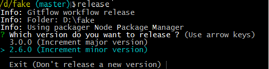

# release

> Release a new version of your Git project


## Installation

Install with npm

```shell
npm install -g git-release
```

## Usage

```shell
release
```

By default, this will

* execute .git/hooks/pre-release (if present)
* increment the patch version (ex: from 1.2.0 to 1.2.1) in the package.json file using the [Semantic Versioning specification](http://semver.org/)
* commit the package.json file
* create a Git tag for the new version
* push to the remote server
* execute .git/hooks/post-release (if present)

You can also increment the minor version (ex: from 1.2.0 to 1.3.0)

```shell
release minor
```

Or the major version  (ex: from 1.2.0 to 2.0.0)

```shell
release major
```

Or force a specific version

```shell
release 1.3.0-alpha
```
## Release a new version of your Git-flow project
If both branches 'master' and 'develop' exist, then git-release presumes the 
repo is used with the Git-flow workflow.  It will leave some actions to the git flow release subcommands.

 * check that the current branch is a release branch.  
 * check the intended version against the version in the package.json
 * exit if there is no advance
 * edit the package.json
 * commit the file



 
If more changes than the version increment need to occur in the release branch, then 
create the branch first and make those changes. 
 The format for the temporary release branch name is `release_<version>`.  
It can be created with `git checkout -b release_<version> develop`.
Later, if the version in the release branch name agrees with the bumped version, 
git-release will detect and use the branch, deleting it on completion: otherwise, it
will ignore the user-created release branch and create a new release branch and version.

### Option -d --distinct 

With this option the develop branch version will have a distinct patch number 
from that of the master branch version.  This can be used to detect a
build mistakenly built in the develop branch.